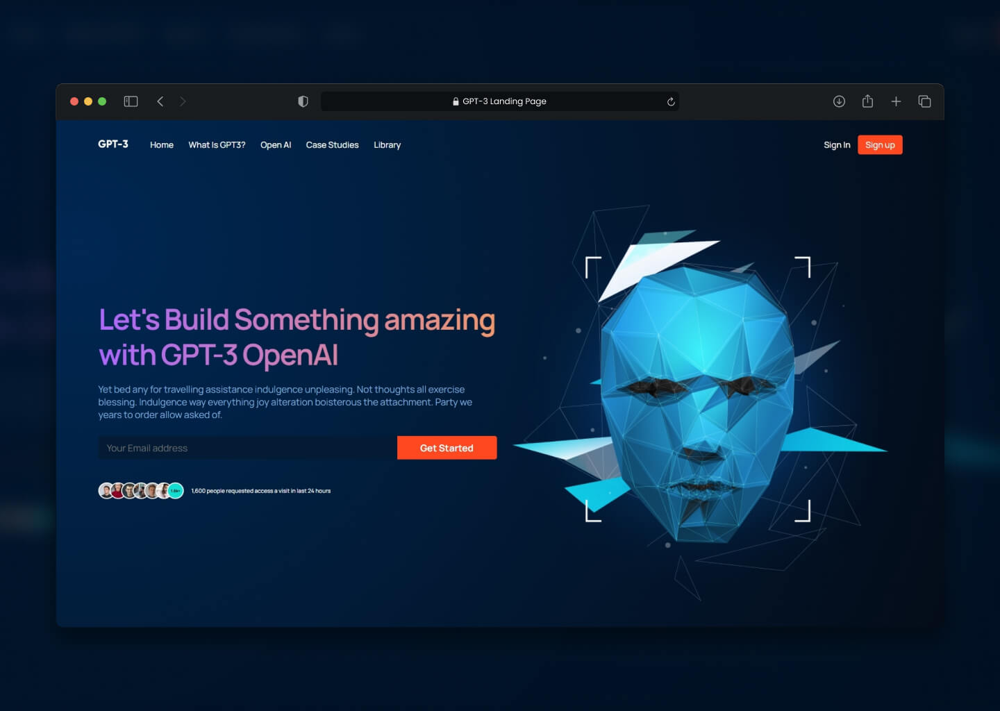

# GPT-3 Landing Page using React



> Simple front-end GPT-3 API landing page

> Live demo [https://jakubparlej.github.io/gpt3-landing-page](https://jakubparlej.github.io/gpt3-landing-page).

## Table of Contents

- [General info](#general-info)
- [Technologies](#technologies)
- [Setup](#setup)

## General info

This project is created with React framework. Layout is designed by [AR Shakir](https://www.arshakir.com/).

## Technologies

Project is created with:

- React
- CSS

## Features

- Navigation bar with GPT-3 Logo and menu
- Hero section
- Brand logos section
- What is GPT-3 Section
- Features section
- Possibilities section
- Simple call to action section
- Blog section
- Footer section

## Setup

To run this project, install it locally using npm:

```
$ npm install   // Install all packages
$ npm start   // Runs the app in the development mode
$ npm run build   // Builds the app for production to the `build` folder
```

## Acknowledgements

This project was based on [this Javascript Mastery youtube tutorial](https://www.youtube.com/watch?v=LMagNcngvcU)

## Contact

Created by [@jakubparlej](https://jprojects.pl) - feel free to contact me!
